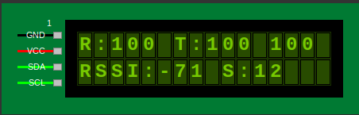

# STM32G070CBTX FreeRTOS Exploration

This project is dedicated to exploring **FreeRTOS** implementations on the **STM32G070** microcontroller. It focuses on building a robust, asynchronous architecture for managing peripherals like LoRa modems, I2C LCDs, and user inputs via GPIO interrupts.

## Project Objectives
- Study and implement FreeRTOS primitives (Tasks, Queues, Thread Flags).
- Develop event-driven drivers for **SX126x LoRa** modems.
- Implement an ACK-based wireless validation protocol.
- Explore asynchronous LCD management for real-time diagnostics.

## Completed Milestones & Issues

Detailed tracking of project progress can be found in the [Closed Issues](https://github.com/sumitadep002/STM32G070CBTX_FreeRTOS/issues?q=is%3Aissue%20state%3Aclosed) section.

| Issue ID | Description |
| :--- | :--- |
| **#14** | Implement ACK-based LoRa TX/RX Validation |
| **#13** | Implement Asynchronous FreeRTOS-based LCD Management |
| **#12** | Handle User inputs via push button |
| **#9** | Bring up 16x2 I2C LCD |
| **#3** | Bring up FreeRTOS |

## LoRa Ping-Pong Protocol
The project features a stable, interrupt-driven ping-pong protocol designed for link validation.
- **Asynchronous Flow**: Uses `osThreadFlags` to synchronize radio interrupts with application tasks.
- **Selective IRQ Handling**: Optimized HAL to process and clear interrupts individually, preventing race conditions.
- **Manual Trigger**: TX mode requires a >1000ms button press to start, allowing for coordinated testing.

### LCD Diagnostic Interface
The 16x2 display provides a high-density, real-time link status for easy troubleshooting.



**Display Legend:**
- **Line 1**: `R:<rx_count> T:<tx_count> <last_payload>`
  - `R`: Total packets received.
  - `T`: Total packets transmitted.
  - `last_payload`: Raw numeric sequence of the last successful exchange.
- **Line 2**: `RSSI:<value> S:<value>`
  - `RSSI`: Signal strength in dBm.
  - `S`: Signal-to-Noise Ratio (SNR) in dB.

## Development Tools

### LCD Simulator
A Python-based **16x2 LCD Simulator** is included to test and visualize display layouts without physical hardware. It accurately mimics the character grid and wiring of a standard I2C LCD module.

**Prerequisites:**
Ensure you have the Python Tkinter library installed:
```bash
sudo apt-get install python3-tk
```

**Usage:**
Run the simulator from the project root:
```bash
python3 lcd_sim.py
```

## Project Structure
- `project/`: Main STM32CubeIDE project directory.
  - `Core/`: Standard initialization and main application logic.
  - `lora/`: Event-driven SX126x driver and HAL abstraction.
  - `lcd/`: Asynchronous I2C LCD driver and management task.
  - `cfg_btn/`: Interrupt-driven button handler with duration measurement.
- `lcd_sim.py`: Python/Tkinter based 16x2 LCD simulator.

## Hardware Requirements
- **Microcontroller**: STM32G070CBTX
- **LoRa Modem**: Semtech SX1262 (via SPI)
- **Display**: 16x2 I2C LCD (Address `0x3E`)
- **Input**: Push button connected to Config Switch Pin (`CFG_SW_Pin`)

## Getting Started
1. **Configure Mode**: Set `LORA_BOARD_MODE` in `lora.h` to `LORA_MODE_TX` or `LORA_MODE_RX`.
2. **Start Receiver**: Power the RX board first; it will automatically enter a listening state.
3. **Start Transmitter**: Power the TX board. It will display `TX READY`.
4. **Trigger Test**: Hold the User Button on the TX board for **1000ms** to start the 100-packet sequence.